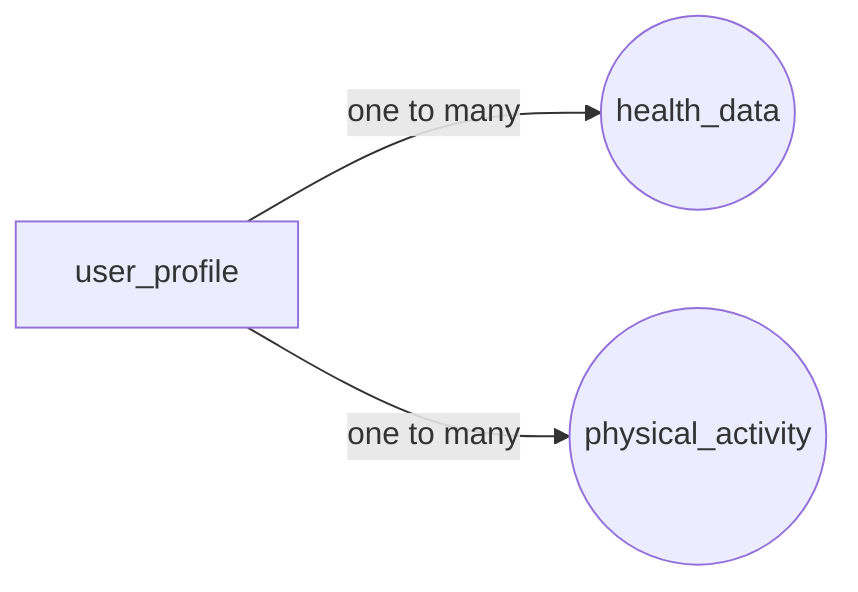

# API Документация FitLife 👩‍💻


# Содержание

#### 0. [База данных](#database)
#### 1. [UserController](#user)
#### 2. [PhysicalActivityDataController](#activity)
#### 3. [HealthDataController](#health)
#### 4. [AuthenticationController](#auth)

---

# <a name="database">База данных 📚</a>

**Используемая база данных**: _PostgreSQL_

## Таблицы

### user_profile:

| Name          | Type           |
|---------------|----------------|
| Id            | `bigint `      |
| user_name     | `varchar(30)`  |
| password_hash | `varchar(256)` |
| email         | `varchar(256)` |    
| height        | `double`       |
| weight        | `double`       |
| date          | `date`         |

### health_data:

| Name            | Type                     |
|-----------------|--------------------------|
| id              | `bigint`                 |
| heart_rate      | `int`                    |
| blood_sugar_lvl | `double`                 |
| blood_pressure  | `varchar`                |
| user_profile_id | `fk -> user_profile(id)` |

### physical_activity

| Name            | Type                     |
|-----------------|--------------------------|
| id              | `bigint`                 |
| steps           | `int`                    |
| distance        | `double`                 |
| workout_time    | `varchar(256)`           |
| calories_burned | `double`                 |
| user_profile_id | `fk -> user_profile(id)` |

## Структура БД



---

## 1. <a name="user">UserController 👤</a>

### 1. Получение одного пользователя

***URL***: ````/api/users/{id}````

**Метод**: <span style="color: green">GET</span>

**Описание**: Этот эндпоинт позволяет получить информацию о пользователе по его идентификатору.

**Параметры запроса**:

- `id` (путь) - Идентификатор пользователя (тип Long).

**Пример запроса**:
````http://api/users/123````

**Результат:**

````
{
    "id": 123,
    "name": "Имя пользователя",
    "email": "user@example.com"
}
````

### 2. Получение списка всех пользователей

***URL:*** ```/api/users```

**Метод:** <span style="color: green">GET</span>

**Описание**: Этот эндпоинт возвращает список всех пользователей.

**Пример запроса**:
``http://api/users``

**Результат:**

````
[
    {
        "id": 1,
        "name": "Пользователь 1",
        "email": "user1@example.com"
    },
    {
        "id": 2,
        "name": "Пользователь 2",
        "email": "user2@example.com"
    }
// Другие пользователи
]
````

### 3. Создание пользователя

***URL:*** ``http://api/users``

**Метод**: <span style="color: yellow">POST</span>

**Описание**: Этот эндпоинт позволяет создать нового пользователя.

**Тело запроса**:

```
{
    "name": "Имя пользователя",
    "email": "user@example.com",
}
```

### 4. Удаление пользователя

***URL:*** ``http://api/users/{id}``

**Метод**: <span style="color:coral">DELETE</span >

**Описание**: Этот эндпоинт позволяет удалять пользователя по идентификатору.

**Пример запроса**: `http://api/users/{id}`

**Параметры запроса**:

- `id` (путь) - Идентификатор пользователя (тип Long).

**Формат ответа**: Возвращает список пользователей после удаления.

**Пример ответа**:

````
[
    {
        "id": 1,
        "name": "Пользователь 1",
        "email": "user1@example.com"
    },
    {
        "id": 2,
        "name": "Пользователь 2",
        "email": "user2@example.com"
    }
// Другие пользователи
]
````

### 5. Изменение пользователя

**Метод**: <span style="color: MediumOrchid">PATCH</span>

**Описание**: Этот эндпоинт позволяет обновить информацию о пользователе по его идентификатору.

**Параметры запроса**:
`id` (путь) - Идентификатор пользователя (тип Long).

**Тело запроса**:
````
{
    "name": "Новое имя пользователя"
}
````
**Пример запроса**:
<span style="color: MediumOrchid">PATCH</span> | `http://api/users/123`
````
{
"id": 123,
"name": "Новое имя пользователя",
"email": "user@example.com"
}
````


## 2. <a name="activity">PhysicalActivityDataController 🏃‍♀️</a>

### 1. Получение данных по физической активности

**URL**: `/api/activities/{userId}/{activityId}`

**Метод**: <span style="color: green">GET</span>

**Описание**: Этот эндпоинт позволяет получить данные по физической активности пользователя по его идентификатору
пользователя (`userId`) и идентификатору активности (`activityId`).

**Параметры запроса**:

- `userId` (путь) - Идентификатор пользователя (тип Long).
- `activityId` (путь) - Идентификатор активности (тип Long).

**Пример запроса**:

<span style="color: green">GET</span> | `http://api/activities/123/456`

**Пример ответа**:
````
{
    "dataId": 456,
    "userId": 123,
// Другие поля данных физической активности
}
````

### 2. Получение списка всех данных по физической активности для пользователя
**URL**: `/api/activities/{userId}`

**Метод**: <span style="color: green">GET</span>

**Параметры запроса**:
- `userId` (путь) - Идентификатор пользователя (тип Long).

**Описание**: Этот эндпоинт возвращает список всех данных по физической активности для указанного пользователя.

**Пример запроса**:

<span style="color: green">GET</span>  | `http://api/activities/123`

**Пример ответа**:
````
{
"_embedded": {
    "activityList": [
        {
            "dataId": 456,
            "userId": 123,
// Другие поля данных физической активности
    },
    {
        "dataId": 789,
        "userId": 123,
// Другие поля данных физической активности
    }
// Другие данные физической активности
]
        },
            "_links": {
            "self": {
            "href": "http://example.com/api/activities/123"
        }
    }
}
````
### 3. Создание данных по физической активности
**URL**: `http://api/activities/{userId}`

**Метод**: <span style="color: yellow">POST</span>

**Описание**: Этот эндпоинт позволяет создать новые данные по физической активности для пользователя.

**Параметры запроса**:

- `userId` (путь) - Идентификатор пользователя (тип Long).

**Тело запроса**:
````
{
    "userId": 123,
// Другие поля данных физической активности
}
````

**Пример запроса**:

<span style="color: yellow">POST</span> | `http://api/activities/123`

**Пример ответа**:

````
{
    "dataId": 456,
    "userId": 123,
// Другие поля данных физической активности
}
````
### 4. Обновление данных по физической активности

**_URL_**: `http://api/activities/{userId}/{activityId}`

**Метод**: <span style="color: MediumOrchid">PATCH</span>

**Описание**: Этот эндпоинт позволяет обновить данные по физической активности для пользователя по их идентификаторам (
userId и activityId).

**Параметры запроса**:

- `userId` (путь) - Идентификатор пользователя (тип Long).
- `activityId` (путь) - Идентификатор активности (тип Long).

**Тело запроса**:

````
{
    "userId": 123,
// Другие обновляемые поля данных физической активности
}
````
**Пример запроса**:

<span style="color: MediumOrchid">PATCH</span> | `http://api/activities/123/456`

**Пример ответа**:

```
{
    "dataId": 456,
    "userId": 123,
// Другие обновленные поля данных физической активности
}
```

### 5. Удаление данных по физической активности
**_URL_**: `http://api/activities/{activityId}`

**Метод**: <span style="color:coral">DELETE</span >

**Описание**: Этот эндпоинт удаляет данные по физической активности по их идентификатору (activityId).

**Параметры запроса**:

- `activityId` (путь) - Идентификатор активности (тип Long).

**Пример запроса**:

<span style="color:coral">DELETE</span > | `http://api/activities/456`

> **Примечание**: Этот эндпоинт может вернуть `204 No Content` в случае успешного удаления или 404 Not Found в случае отсутствия
данных физической активности.

## 3. <a name="health">HealthDataController 💖</a>

### 1. Получение всех данных о здоровье для пользователя

_**URL**_: `/api/healths/{userId}`

**Метод**: <span style="color: green">GET

**Описание**: Этот эндпоинт позволяет получить список всех данных о здоровье для указанного пользователя.

**Параметры запроса**:

- `userId` (путь) - Идентификатор пользователя (тип Long).

**Пример запроса**:

<span style="color: green">GET</span> | `http://api/healths/123`

Пример ответа:

````
{
"_embedded": {
"healthList": [
    {
    "id": 1,
    "userId": 123,
  // Другие поля данных о здоровье
    },
    {
    "id": 2,
    "userId": 123,
  // Другие поля данных о здоровье
    }
// Другие данные о здоровье
]
},
    "_links": {
            "self": {
            "href": "http://example.com/api/healths/123"
        }
    }
}
````
### 2. Получение данных о здоровье по идентификатору
**_URL_**: `http://api/healths/{userId}/{healthId}`

**Метод**: <span style="color: green">GET

**Описание**: Этот эндпоинт позволяет получить данные о здоровье пользователя по идентификатору пользователя (userId) и
идентификатору данных о здоровье (healthId).

**Параметры запроса**:

- `userId` (путь) - Идентификатор пользователя (тип Long).
- `healthId` (путь) - Идентификатор данных о здоровье (тип Long).

**Пример запроса**:

<span style="color: green">GET</span> | `http://api/healths/123/1`


**Пример ответа**:

````
{
    "id": 1,
    "userId": 123,
// Другие поля данных о здоровье
}
````

### 3. Создание данных о здоровье
**_URL_**: `http://api/healths/{userId}`

**Метод**: <span style="color: yellow">POST</span>

**Описание**: Этот эндпоинт позволяет создать новые данные о здоровье для пользователя.

**Параметры запроса**:

- `userId` (путь) - Идентификатор пользователя (тип Long).

**Тело запроса**:


````
{
    "userId": 123,
// Другие поля данных о здоровье
}
````
**Пример запроса**:

<span style="color: yellow">POST</span> | `http://api/healths/123`
Пример ответа:

````
{
    "id": 1,
    "userId": 123,
// Другие поля данных о здоровье
}
````
### 4. Обновление данных о здоровье
**_URL_**: `http://api/healths/{userId}/{healthId}`

**Метод**: <span style="color: MediumOrchid">PATCH</span>

**Описание**: Этот эндпоинт позволяет обновить данные о здоровье пользователя по идентификаторам (userId и healthId).

**Параметры запроса**:

- `userId` (путь) - Идентификатор пользователя (тип Long).
- `healthId` (путь) - Идентификатор данных о здоровье (тип Long).

**Тело запроса**:
````
{
    "userId": 123,
// Другие обновляемые поля данных о здоровье
}
````
**Пример запроса**:

<span style="color: MediumOrchid">PATCH</span> | `http://api/healths/123/1`

**Пример ответа**:

````
{
    "id": 1,
    "userId": 123,
// Другие обновленные поля данных о здоровье
}
````
### 5. Удаление данных о здоровье
**_URL_**: `http://api/healths/{healthId}`

**Метод**: <span style="color:coral">DELETE</span >

**Описание**: Этот эндпоинт удаляет данные о здоровье по идентификатору (healthId).

**Параметры запроса**:

- healthId (путь) - Идентификатор данных о здоровье (тип Long).

**Пример запроса**:

<span style="color:coral">DELETE</span > | `http://api/healths/1`

> **Примечание**: Этот эндпоинт может вернуть `204 No Content` в случае успешного удаления или 404 Not Found в случае отсутствия
данных о здоровье.

## 4. <a name="auth">AuthenticationController 🔐</a>

### 1. Регистрация пользователя

**_**URL**_**: `/api/in/register`

**Метод**: <span style="color: yellow">POST</span>

**Описание**: Этот эндпоинт позволяет зарегистрировать нового пользователя.

**Тело запроса**:
````
{
    "username": "Имя пользователя",
    "password": "Пароль пользователя"
}
````
**Пример запроса**:

<span style="color: yellow">POST</span> | `http://api/in/register`

**Пример ответа**:
````
{
    "token": "JWT-токен",
    "username": "Имя пользователя"
}
````

### 2. Аутентификация пользователя
**_URL_**: `http://api/in/auth`

**Метод**: <span style="color: yellow">POST</span>

**Описание**: Этот эндпоинт позволяет аутентифицировать пользователя и получить JWT-токен для доступа к защищенным ресурсам.

**Тело запроса**:

````
{
"username": "Имя пользователя",
"password": "Пароль пользователя"
}
````

**Пример запроса**:

<span style="color: yellow">POST</span> | `http://api/in/auth`

**Пример ответа**:

````
{
    "token": "JWT-токен",
    "username": "Имя пользователя"
}
````